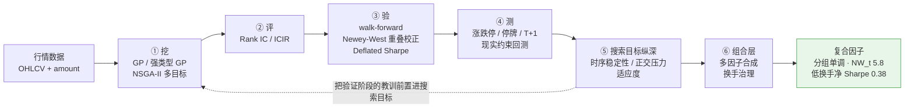

# FactorMiner

基于遗传规划 (Genetic Programming) 的 A 股 alpha 因子自动挖掘。

## 目标

利用 GP 算法从 A 股行情数据中自动搜索有效的 alpha 因子表达式，复现量化因子挖掘的经典方法。

## 方法

1. **表达式树表示**：用树结构表达因子公式，叶节点为行情特征（open/close/volume/amount 等），内部节点为算子；可选**强类型 GP**（截面维/时序维/标量类型约束），只生成合法因子
2. **算子集**：算术、截面排名、时序统计（ts_mean, ts_std, ts_rank, delay, delta, decay_linear），以及二元时序算子 ts_corr（价量关系）
3. **进化搜索**：锦标赛选择 + 子树交叉/变异；NSGA-II 多目标（|ICIR| vs 树复杂度）保前沿多样性
4. **适应度评估**：Rank IC / ICIR 为主指标，并可前置**时序稳定性**、**正交压力**等搜索目标
5. **严格验证**：walk-forward 样本外 + Newey-West 重叠校正 + Deflated Sharpe 选择偏差校正——把「样本内虚高」剥干净
6. **现实回测**：涨跌停/停牌过滤、long-only、T+1 开盘成交
7. **组合层**：多因子合成（rank 归一 + 符号对齐 + 等权）+ 换手治理（信号平滑降换手）

> 详细实验笔记见 [`doc/`](doc/)：[验证模块](doc/验证模块.md)、[强类型GP](doc/强类型GP.md)、[算子与数据](doc/算子与数据.md)、[回测现实性](doc/回测现实性.md)、[适应度函数纵深](doc/适应度函数纵深.md)、[多因子合成](doc/多因子合成.md)。

## 研究流水线

一条完整的「挖 → 评 → 验 → 测 → 搜索目标 → 组合」因子研究链路，每一环都用统计检验把「看起来有效」和「真有效」分开：



> **核心结论**：A 股纯量价 alpha 真实存在、统计显著、分组单调，但瓶颈在**换手成本结构**而非信号匮乏——原始信号毛多空 Sharpe 0.75 被交易成本吃光，5 日平滑（低换手实现）后净 Sharpe 转正至 0.38。

## 快速开始

```bash
# 安装依赖
pip install -r requirements.txt

# 配置数据源（首次使用）
cp .env.example .env   # 编辑填入 TUSHARE_TOKEN

# 下载行情数据（首次运行，约 10 分钟）
python scripts/fetch_data.py --universe hs300 --start 2018-01-01 --end 2024-12-31

# 运行 GP 因子挖掘
python scripts/run_gp.py configs/default.yaml
```

## 数据管理

### 数据源

通过项目根目录 `.env` 文件切换数据源：

| 数据源  | 说明                             | 配置                                             |
| ------- | -------------------------------- | ------------------------------------------------ |
| akshare | 免费无需注册，部分服务器网络受限 | `DATA_SOURCE=akshare`                            |
| tushare | 稳定，需注册获取 token           | `DATA_SOURCE=tushare` `TUSHARE_TOKEN=your_token` |

tushare token 在 [tushare.pro](https://tushare.pro) 注册后个人中心获取。

### 缓存结构

数据以 Parquet 格式缓存，**逐股存储，支持断点续传**，中途中断重新运行自动跳过已下载的：

```text
data/cache/
├── universe_hs300.txt               # 成分股列表（7天TTL自动刷新）
└── stocks/
    ├── akshare/
    │   └── 000001_2018-01-01_2024-12-31.parquet
    └── tushare/
        └── 000001_2018-01-01_2024-12-31.parquet
```

### 数据格式

`load_daily_prices()` 返回前复权日频数据：

```txt
MultiIndex: (date: Timestamp, code: str)
Columns:    open, high, low, close, volume, amount, turnover
```

### 限速说明

- akshare：0.5s/次（服务器 IP 可能被限，建议用 tushare）
- tushare 免费版：2s/次（上限 50次/分钟）

## 实验日志

长时间 GP 实验的日志自动保存到 `results/logs/`，按实验 ID 归档：

```text
results/logs/
└── exp_20240115_143022/
    ├── run.log        # 完整文本日志，同时输出到终端
    └── stats.jsonl    # 每代进化指标（每行一个 JSON）
```

不进 tmux 也能查看进度：

```bash
tail -f results/logs/exp_<id>/run.log
```

在 notebook 里分析实验曲线：

```python
from utils.logger import load_stats
stats = load_stats("results/logs/exp_20240115_143022")
# stats 是 list[dict]，每代一条：gen, best_ic, mean_ic, best_expr, ts
```

## 项目结构

```text
src/
├── data/          # 数据获取与处理
├── gp/            # GP 进化引擎（算子、表达式树、主循环）
├── evaluation/    # 因子评估（IC、ICIR、分组收益）
├── backtest/      # 分组回测
└── utils/
    └── logger.py  # 实验日志模块

configs/           # 实验配置（YAML）
scripts/           # 运行脚本
notebooks/         # 实验笔记
results/logs/      # 实验日志（不入库）
```

## 进度

### 复现链路

- [x] 项目骨架 + A 股数据接口（akshare / tushare，断点续传）+ 实验日志
- [x] GP 引擎（表达式树、遗传操作、进化主循环）+ 适应度函数 + 首次全量实验
- [x] 因子评估指标（IC、ICIR、分组收益）+ 分组回测

### 进阶研究

- [x] GP 算法纵深：ramped half-and-half、深度门禁、parsimony 简约压力、NSGA-II 多目标、强类型 GP
- [x] 因子验证：walk-forward + Newey-West 重叠校正 + Deflated Sharpe
- [x] 算子扩展：ts_corr 等；并发现/修复 reward hacking（近常数因子黑 ICIR）
- [x] 现实回测：涨跌停/停牌过滤、long-only、T+1 开盘成交
- [x] 适应度纵深：时序稳定性、正交压力
- [x] 多因子合成 + 换手治理（成果：低换手净 Sharpe 0.38）
- [x] 工程：joblib 并行评估（全量 8h→1h）、统一评估入口

### 待续（可选）

- [ ] 换手惩罚前置进适应度
- [ ] IC 加权合成、引入正交（基本面/资金流）数据
- [ ] 组合优化 / 冲击成本建模
