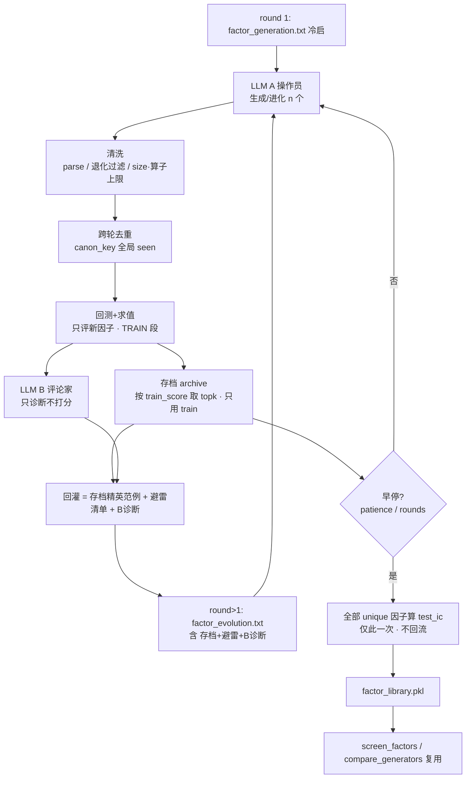
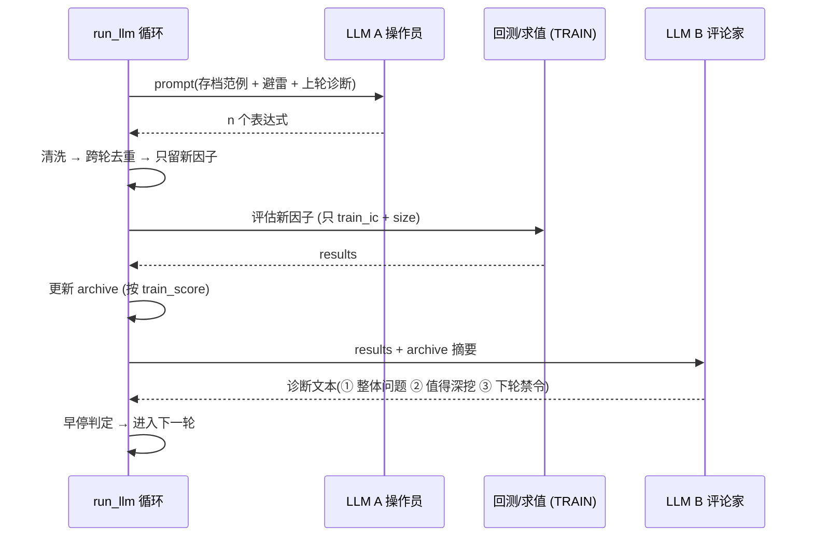

# LLM 进化挖因子（操作员–评论家）

GP、RL 之后的**第三个生成器**。沿用 mentor 给的终点方向：神经符号 / LLM 辅助生成。
本质是 **LLM 进化搜索**（FunSearch / Reflexion 一类）：LLM 当变异算子 + 回测反馈引导选择。
入口：`python scripts/run_llm.py [config]`。

## 铁律：搜索回路里只能看 train，绝不能看 test

循环要跑多轮、不断拿成绩引导 A 进化。**若用 `test_ic` 排存档 / 喂 B / 喂 A，等于让搜索偷看
测试集 N 轮 → 必然过拟合 test，且与 GP/RL 的对比直接作废**（它们 OOS 是诚实的）。

- 存档排序、B 诊断、A 回灌——**全程只用 train 段指标**：`train_score = |train_ic| − parsimony·size`。
- `test_ic` 每个因子**只在最终落盘时算一次**，做诚实 OOS，**永不进回路**。
- 训练段限在 regime 内（`train_start: 2021-01-01`，见 [regime断点](regime断点.md)）。

## 数据流



A 与 B 的回合交互：



## 各角色职责

### LLM A（操作员，generate_trees 已有）

单次调用提 n 个因子。round 1 用冷启 prompt；round>1 用进化 prompt，回灌内容见下。

### 清洗（src/llm/clean.py）—— 省钱命门

回测是耗时大头（曾跑 8 小时），只回测**有效且新**的因子。分层：

```txt
parse 合法(parser 已做) → 退化过滤(求值 NaN/常数即弃) → size·算子数上限 → canon_key 跨轮去重
```

退化定义：**求值返回 NaN 或常数序列即弃**（x−x、同窗口自减天然落此类）。

### 回测/求值（src/core/evaluator.py 复用）

只对新因子算 **train 段** `train_ic` + `size`。test_ic 不在这里算。

### 存档 archive

跨轮精英，条目 `{expr, tree, size, train_ic, round_added}`——**故意不存 test_ic**（呼应铁律）。
按 `train_score = |train_ic| − parsimony·size` 取 top `archive_size`。

### LLM B（评论家，src/llm/critic.py）

**只诊断不打分**——硬数字已由回测给出，B 的唯一价值是产出数字给不了的东西：
诊断病灶 + 翻译成给 A 的可执行指令。输出三段自由文本（不要 JSON，解析 LLM 结构化输出脆弱）：

1. 这批整体问题（撞 amount 天花板 / 过拟合 / 退化 / 同质化）
2. 哪些方向值得深挖（点名 archive 里的成功结构）
3. 下一轮明确禁令/指令（喂给 A）

> **机械的避雷清单（avoid_list）用代码从指标算**（退化 ∪ 撞天花板 ∪ 低分），不依赖 B。
> B 每轮都调（配置 `critic_every` 可调成只在无提升轮调，省钱）。

### 回灌给 A（比"有反馈"本身更重要）

喂三样，缺一不可（只回灌上一轮会让 A 健忘、原地打转）：

- **存档精英** + 其 train 指标 → 当 few-shot 范例（即 GP 的 elitism）
- **避雷清单**（跨轮去重的失败族系）
- **B 的诊断文本**

## 选择 vs 评论的分工

| 决定               | 由谁做                                     |
| ------------------ | ------------------------------------------ |
| 谁活下来进存档     | **代码 + 硬指标**（train_score），不交给 B |
| 为什么失败、往哪改 | **LLM B**（定性诊断）                      |
| 机械避雷清单       | **代码**（从指标算）                       |

## 落盘与审计（复用 src/utils/logger.py）

temperature 锁不死可复现，退而求其次：**全量留痕，保证可审计、可回放**。

```txt
results/logs/exp_..._llm/
  meta.json            # logger 自带（argv / git_commit / config）
  run.log              # 每轮计数
  stats.jsonl          # log_generation 每轮一行（gen=round, best/mean train_ic, ...）
  rounds/round_NN/
    prompt_a.txt  response_a.txt
    prompt_b.txt  response_b.txt
  factor_library.pkl
```

`factor_library.pkl` 用统一 schema `{config_path, split, n_explored, factors:[{expr, tree, size,
train_ic, test_ic}]}`，`n_explored = len(seen)`（deflated Sharpe 要用），下游 screen / compare 复用。
见 [顶层设计](顶层设计.md)。

## 防 reward hacking

一跟 LLM 说"把 IC 弄高"，它就堆 bloat、造退化因子（已见过 x−x）。对策与 RL 同源
（见 [适应度函数纵深](适应度函数纵深.md)）：parsimony + `max_operators` + 退化过滤在清洗阶段硬卡，
**不指望 prompt 自觉**。

## 已知局限

- temperature=1.0 不可复现，只能靠全量留痕审计（不像 RL 的 seed=42 可严格复现）。
- 当前终端仅价量 6 个，撞 amount 天花板的结论同样适用——**LLM 不会凭空变出 alpha**。
  真正破局要接价量正交的金融文本/基本面数据（待解决数据获取）。

## 实施顺序

1. `configs/default.yaml` 加 `llm:` 段
2. `prompts/factor_evolution.txt`、`prompts/factor_critique.txt`
3. `src/llm/clean.py`（清洗/去重/退化）
4. `src/llm/critic.py`（LLM B）
5. `scripts/run_llm.py`（循环主体 + 落盘）
6. smoke 配置跑通 → 接 compare_generators
